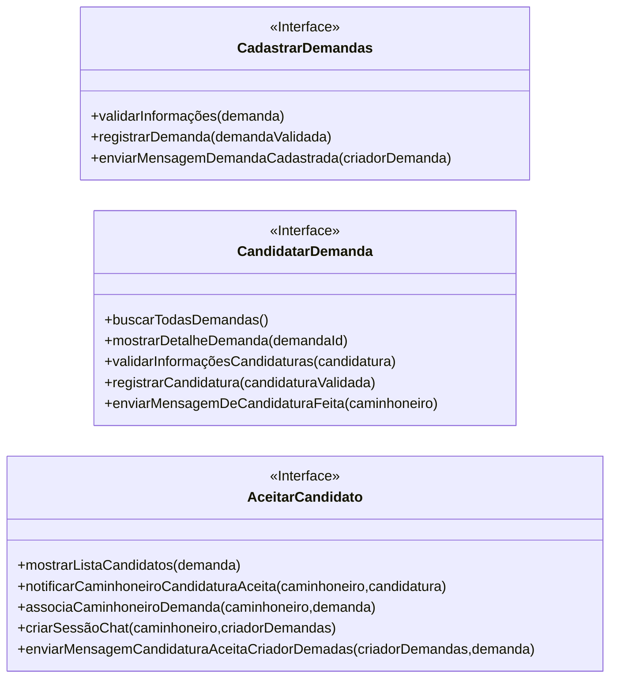
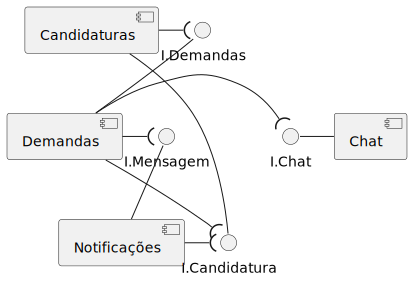

# 1) Diagrama de Casos de usos

```mermaid
---
config:
  theme: neutral
---
graph LR
    %% Atores
    %% 1. Defina uma classe CSS para a forma oval


    E["<div style="font-size:120px">𖨆</div><br><div style="font-size:30px">Criador de demandas</div>"]
    A["<div style="font-size:120px">𖨆</div><br><div style="font-size:30px">Caminhoneiro</div>"]

    UC1(["**UC-01** Cadastrar demandas"])
    UC2(["**UC-02** Candidatar-se em uma demanda"])
    UC3(["**UC-03** Aceitar um candidato à demanda"])


    %% Relacionamentos - Criador de demandas
    E --> UC1
    E --> UC3

    %% Relacionamentos - Caminhoneiro
    A --> UC2

    %% Estilos
    classDef ator fill:#ffffff,stroke:#ffffff,stroke-width:2px,color:#000
    classDef casoUso fill:#fff2cc,stroke:#d6b656,stroke-width:1px,color:#000,width:90px
    classDef ovalNode fill:#fff,stroke:#000,border-radius:50%

    class E,A ator
    class UC1,UC2,UC3,UC4,UC5,UC6,UC7,UC8 ovalNode

```

# 2) Fluxos dos casos de usos

## **UC-01** Cadastrar demandas

1. Sistema solicita informações das demandas
1. Criador de demandas preenche o formulario
1. Sistema valida as informações
1. Sistema registrar a demanda
1. Sistema envia mensagem de demanda cadastrada com sucesso

## **UC-02** Candidatar-se em uma demanda

1. Caminhoneiro acessa a tela de demandas
1. Sistema busca todas as demandas
1. Caminhoneiro acessa a tela de alguma demanda
1. Sistema mostra detalhes da demanda
1. Caminhoneiro clica em candidatar-se
1. Sistema solicita informações para a candidatura
1. Caminhoneiro preenche as informações
1. Sistema valida as informações da candidatura
1. Sistema registra a candidatura
1. Sistema envia mensagemm de candidatura bem sucedida

## **UC-03** Aceitar um candidato à demanda

1. Criador de demanda acessa a pagina de candidaturas da demanda
1. Sistema mostra listas de candidatos para cada demanda
1. Criador de demandas aceita a candidatura
1. Sistema associa caminhoneiro para a demanda
1. Sistema notifica o caminhoneiro
1. Sistema cria uma seção de chat com os 2 envolvidos
1. Sistema envia mensagem de candidatura aceita com sucesso para o criador de demandas

# 3) Interfaces do sistema

```mermaid
---
config:
  layout: elk
---
classDiagram
direction LR

    class CadastrarDemandas {
	  +validarInformações(demanda)
      +registrarDemanda(demandaValidada)
      +enviarMensagemDemandaCadastrada(criadorDemanda)

    }

    class CandidatarDemanda{
      +buscarTodasDemandas()
      +mostrarDetalheDemanda(demandaId)

      +validarInformaçõesCandidaturas(candidatura)
      +registrarCandidatura(candidaturaValidada)
      +enviarMensagemDeCandidaturaFeita(caminhoneiro)

    }

    class AceitarCandidato{
      +mostrarListaCandidatos(demanda)
      +notificarCaminhoneiroCandidaturaAceita(caminhoneiro,candidatura)

      +associaCaminhoneiroDemanda(caminhoneiro,demanda)
      +criarSessãoChat(caminhoneiro,criadorDemandas)
      +enviarMensagemCandidaturaAceitaCriadorDemadas(criadorDemandas,demanda)

    }


  <<Interface>> CadastrarDemandas
  <<Interface>> CandidatarDemanda
  <<Interface>> AceitarCandidato
```

# 4) Interfaces coesas

```mermaid
---
config:
  layout: elk
---
classDiagram
direction LR

    class DemandasService {
	  +validarInformações(demanda)
      +registrarDemanda(demandaValidada)
      +buscarTodasDemandas()
      +mostrarDetalheDemanda(demandaId)
      +associaCaminhoneiroDemanda(caminhoneiro,demanda)
    }

    class MensagemService{
      +enviarMensagemDemandaCadastrada(criadorDemanda)
      +enviarMensagemDeCandidaturaFeita(caminhoneiro)
      +notificarCaminhoneiroCandidaturaAceita(caminhoneiro,candidatura)
      +enviarMensagemCandidaturaAceitaCriadorDemadas(criadorDemandas,demanda)
    }

    class CandidaturaService{
      +validarInformaçõesCandidaturas(candidatura)
      +registrarCandidatura(candidaturaValidada)
      +mostrarListaCandidatos(demanda)

    }
    class ChatService{
      +criarSessaoChat(caminhoneiro,criadorDemandas)
    }

  <<Interface>> DemandasService
  <<Interface>> MensagemService
  <<Interface>> ChatService
  <<Interface>> CandidaturaService
```

# 5) Componentes do Sistema

## Componente de Demandas

Interface Fornecida: DemandasService

## Componente de Notificações

Interface Fornecida: MensagemService

## Componente de Chat

Interface Fornecida: ChatService

## Componete de Candidatura

Interface Fornecida: CandidaturaService

# 6) Contrato das Operações

## DemandaService

### **Operação:** validarInformações(demanda)

**Pré Condições:**

- Demanda não deve ser nula
- Demanda deve estar no formato válido

**Pós Condições:**

- Demanda cadastrada com sucesso
  ou
- Demanda inválida

### **Operação:** registrarDemanda(demandaValidada)

**Pré-Condições:**

- A demanda deve ser válida

**Pós Condições:**

- Demanda registrada com sucesso
  ou
- Demanda não registrada

### **Operação:** buscarTodasDemandas()

**Pré-Condições:**

**Pós Condições:** As demandas existentes são mostradas

### **Operação:** mostrarDetalheDemanda(demandaId)

**Pré-Condições:**

- O Id da demanda deve se referir a uma demanda existente
- O Id da demanda não pode ser nulo

**Pós Condições:**

- A demanda requisitada é exibida
  ou
- Não é encontrado demanda com o ID fornecido

### **Operação:** associaCaminhoneiroDemanda(caminhoneiro,demanda)

**Pré-Condições:**

- O caminhoneiro deve estar cadastrado
- O caminhoneiro deve estar sem demandas associadas
- A demanda deve existir no sistema
- Caminhoneiro não deve ser nulo
- Demanda não deve ser nula

**Pós Condições:**

- O caminhoneiro é associado à demanda
  ou
- Associação não criada

## MensagemService

### **Operação:** enviarMensagemDemandaCadastrada(criadorDemanda)

**Pré-Condições:**

- O criador da demanda não deve ser nulo
- O criador da demanda deve existir

**Pós Condições:**

- Mensagem enviada ao criador com as informações do cadastro

### **Operação:** enviarMensagemDeCandidaturaFeita(caminhoneiro)

**Pré-Condições:**

- O caminhoneiro deve estar cadastrado
- O caminhoneiro não deve ser nulo

**Pós Condições:**

- Mensagem enviada com sucesso ao caminhoneiro com as informações da candidatura

### **Operação:** notificarCaminhoneiroCandidaturaAceita(caminhoneiro,candidatura)

**Pré-Condições:**

- O caminhoneiro deve estar cadastrado
- O caminhoneiro não deve ser nulo
- O caminhoneiro deve ter se candidato a uma demanda
- A candidatura não deve ser nula
- A candidatura deve ter sido aceita pelo criador

**Pós Condições:**

- Mensagem enviada com sucesso ao caminhoneiro com as informações do aceite da candidatura

### **Operação:** enviarMensagemCandidaturaAceitaCriadorDemadas(criadorDemandas,demanda)

**Pré-Condições:**

- O criador deve estar cadastrado
- O criador não deve ser nulo
- O criador deve ter criado uma demanda
- A demanda não deve ser nula
- A demanda dever estar no formato válido

**Pós Condições:**

- Mensagem enviada com sucesso ao criador da demanda

## CandidaturaService

### **Operação:** registrarCandidatura(candidaturaValidada)

**Pré-Condições:**

- A candidatura deve ter sido válidada
- A candidatura não deve ser nula

**Pós Condições:**

- Candidatura criada
  ou
- Candidatura não criada

### **Operação:** validarInformaçõesCandidaturas(candidatura)

**Pré-Condições:**

- A candidatura deve estar em um formato válido
- A candidatura não deve ser nula

**Pós Condições:**

- Candidatura validada
  ou
- Candidatura não validada

### **Operação:** mostrarListaCandidatos(demanda)

**Pré-Condições:**

- A demanda não deve ser nula
- A demanda deve ter sido validada
- O candidato deve ter se candidatado aquela demanda

**Pós Condições:**

- Mostra os candidatos a aquela demanda
  ou
- Informa que a demanda é inválida

## ChatService

### **Operação:** criarSessaoChat(caminhoneiro,criadorDemandas)

**Pré-Condições:**

- O caminhoneiro deve ter sido aceito na demanda
- O caminhoneiro não deve ser nulo
- O caminhoneiro deve estar cadastrado
- O criador da demanda deve existir
- O criador da demanda não deve ser nulo

**Pós Condições:**

- Sessão de chat criada com sucesso
  ou
- Sessão de chat não criada

# 7) Dependências entre Componentes

## Demandas:

1. Requer CandidaturaService: Necessário no fluxo de "Aceitar um candidato à demanda". O componente precisa requisitar a lista de caminhoneiros que se candidataram àquele frete específico para permitir a escolha do criador.

1. Requer MensagemService: Utilizado para delegar o disparo das notificações de sucesso ao registrar uma nova carga no sistema e ao associar um motorista de forma definitiva.

1. Requer ChatService: Acionado na pós-condição do aceite do candidato, solicitando a abertura imediata de um canal de comunicação entre o motorista aprovado e o embarcador/criador da demanda.

## Candidaturas:

1. Requer DemandasService: Essencial no momento de "Candidatar-se em uma demanda". É consumido para validar se o identificador fornecido corresponde a uma demanda real, ativa e disponível no banco de dados antes de registrar a candidatura.

1. Requer MensagemService: Consumido no fim do fluxo de candidatura para garantir o envio da confirmação ao caminhoneiro de que o seu interesse foi devidamente registrado no sistema.

# 8) Diagrama Completo

