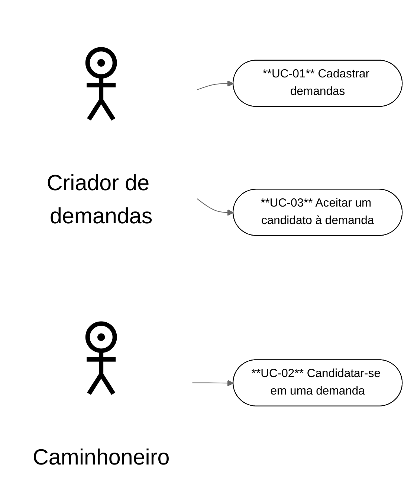
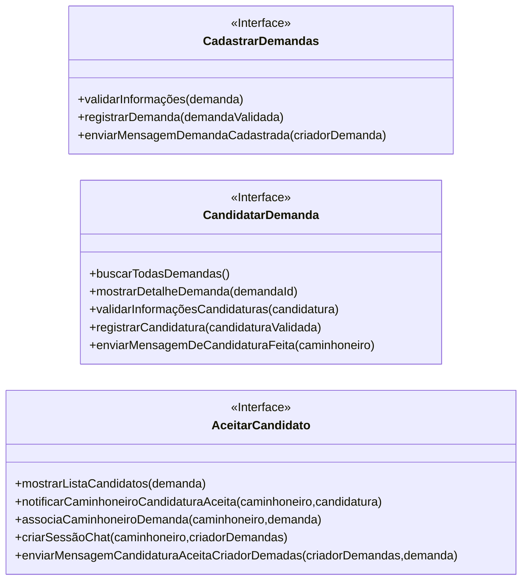
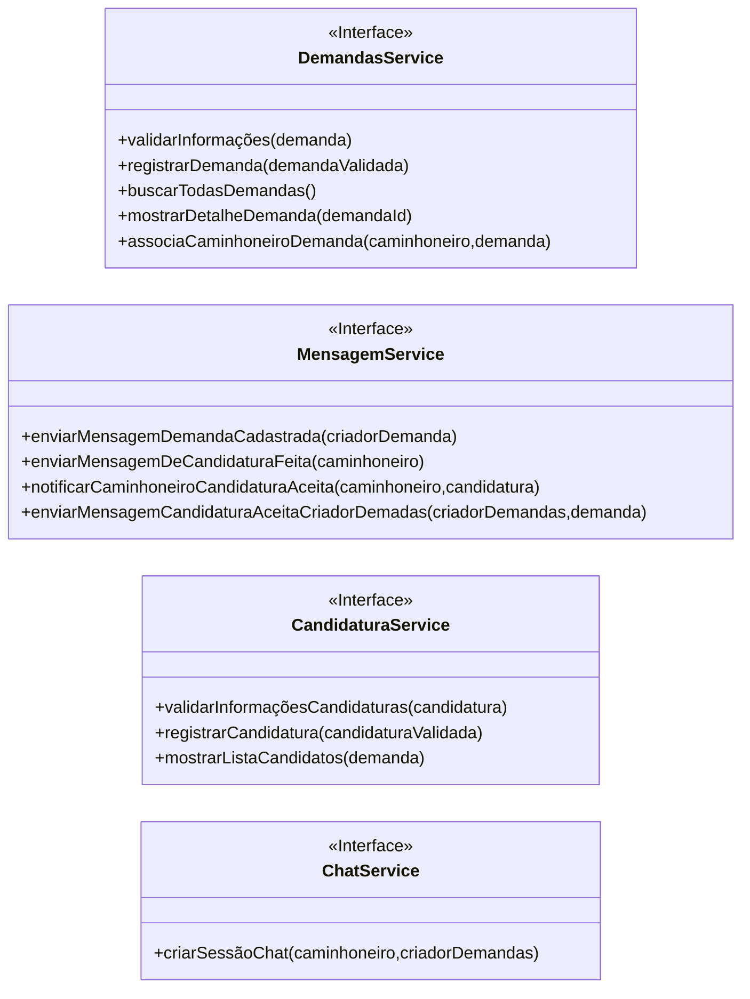

# 1) Diagrama de Casos de usos

```mermaid
---
config:
  theme: neutral
---
graph LR
    %% Atores
    %% 1. Defina uma classe CSS para a forma oval
    

    E["<div style="font-size:120px">𖨆</div><br><div style="font-size:30px">Criador de demandas</div>"]
    A["<div style="font-size:120px">𖨆</div><br><div style="font-size:30px">Caminhoneiro</div>"]
    
    UC1(["**UC-01** Cadastrar demandas"])
    UC2(["**UC-02** Candidatar-se em uma demanda"])
    UC3(["**UC-03** Aceitar um candidato à demanda"])

    
    %% Relacionamentos - Criador de demandas
    E --> UC1
    E --> UC3
    
    %% Relacionamentos - Caminhoneiro
    A --> UC2
    
    %% Estilos
    classDef ator fill:#ffffff,stroke:#ffffff,stroke-width:2px,color:#000
    classDef casoUso fill:#fff2cc,stroke:#d6b656,stroke-width:1px,color:#000,width:90px
    classDef ovalNode fill:#fff,stroke:#000,border-radius:50%
    
    class E,A ator
    class UC1,UC2,UC3,UC4,UC5,UC6,UC7,UC8 ovalNode
    
```

# 2) Fluxos dos casos de usos

## **UC-01** Cadastrar demandas
1. Sistema solicita informações das demandas
1. Criador de demandas preenche o formulario
1. Sistema valida as informações
1. Sistema registrar a demanda
1. Sistema envia mensagem de demanda cadastrada com sucesso

## **UC-02** Candidatar-se em uma demanda
1. Caminhoneiro acessa a tela de demandas
1. Sistema busca todas as demandas 
1. Caminhoneiro acessa a tela de alguma demanda
1. Sistema mostra detalhes da demanda
1. Caminhoneiro clica em candidatar-se
1. Sistema solicita informações para a candidatura
1. Caminhoneiro preenche as informações
1. Sistema valida as informações da candidatura
1. Sistema registra a candidatura
1. Sistema envia mensagemm de candidatura bem sucedida

## **UC-03** Aceitar um candidato à demanda

1. Criador de demanda acessa a pagina de candidaturas da demanda
1. Sistema mostra listas de candidatos para cada demanda
1. Criador de demandas aceita a candidatura
1. Sistema associa caminhoneiro para a demanda
1. Sistema notifica o caminhoneiro
1. Sistema cria uma seção de chat com os 2 envolvidos
1. Sistema envia mensagem de candidatura aceita com sucesso para o criador de demandas

# 3) Interfaces do sistema

```mermaid 
---
config:
  layout: elk
---
classDiagram
direction LR
    
    class CadastrarDemandas {
	  +validarInformações(demanda)
      +registrarDemanda(demandaValidada)
      +enviarMensagemDemandaCadastrada(criadorDemanda)

    }

    class CandidatarDemanda{
      +buscarTodasDemandas()
      +mostrarDetalheDemanda(demandaId)

      +validarInformaçõesCandidaturas(candidatura)
      +registrarCandidatura(candidaturaValidada)
      +enviarMensagemDeCandidaturaFeita(caminhoneiro)

    }

    class AceitarCandidato{
      +mostrarListaCandidatos(demanda)
      +notificarCaminhoneiroCandidaturaAceita(caminhoneiro,candidatura)

      +associaCaminhoneiroDemanda(caminhoneiro,demanda)
      +criarSessãoChat(caminhoneiro,criadorDemandas)
      +enviarMensagemCandidaturaAceitaCriadorDemadas(criadorDemandas,demanda)
            
    }
    

  <<Interface>> CadastrarDemandas
  <<Interface>> CandidatarDemanda
  <<Interface>> AceitarCandidato
```
# 4) Interfaces coesas

```mermaid 
---
config:
  layout: elk
---
classDiagram
direction LR
    
    class DemandasService {
	  +validarInformações(demanda)
      +registrarDemanda(demandaValidada)
      +buscarTodasDemandas()
      +mostrarDetalheDemanda(demandaId)
      +associaCaminhoneiroDemanda(caminhoneiro,demanda)
    }

    class MensagemService{
      +enviarMensagemDemandaCadastrada(criadorDemanda)
      +enviarMensagemDeCandidaturaFeita(caminhoneiro)
      +notificarCaminhoneiroCandidaturaAceita(caminhoneiro,candidatura)
      +enviarMensagemCandidaturaAceitaCriadorDemadas(criadorDemandas,demanda)
    }

    class CandidaturaService{
      +validarInformaçõesCandidaturas(candidatura)
      +registrarCandidatura(candidaturaValidada)
      +mostrarListaCandidatos(demanda)
            
    }
    class ChatService{
      +criarSessãoChat(caminhoneiro,criadorDemandas)
    }

  <<Interface>> DemandasService
  <<Interface>> MensagemService
  <<Interface>> ChatService
  <<Interface>> CandidaturaService
```

# 5) Componentes do Sistema
1. Demandas
2. Candidatura
3. Mensagem
4. Chat

# 6) Contrato das Operações
## Componente Demandas
### **Operação:** Registrar Demandas

**Pré-Condições:**
- Usuário deve estar logado
- A demanda deve ser válida

**Pós Condições:**
- Demanda criada é persistente

### **Operação:** Buscar Demanda

**Pré-Condições:**
- As demandas devem ser válidas

**Pós Condições:** As demandas existentes são mostradas

### **Operação:** Mostrar Detalhe Demanda

**Pré-Condições:**
- A demanda deve ser válida

**Pós Condições:**
- A demanda requisitada é exibida

### **Operação:** Associar Caminhoneiro a Demanda

**Pré-Condições:**
- O caminhoneiro deve estar cadastrado
- O caminhoneiro deve estar sem demandas associadas
- A demanda deve ser válida

**Pós Condições:**
- Associação criada é persistente

## Componente Candidatura
### **Operação:** Registrar Candidatura

**Pré-Condições:**
- A candidatura deve ser válida

**Pós Condições:**
- O caminhoneiro será registrado como candidato a tarefa
