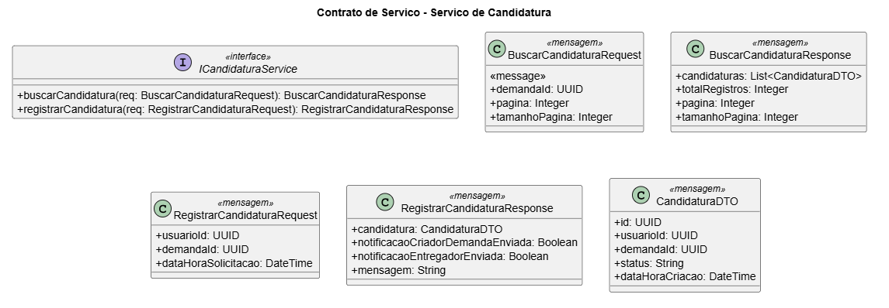
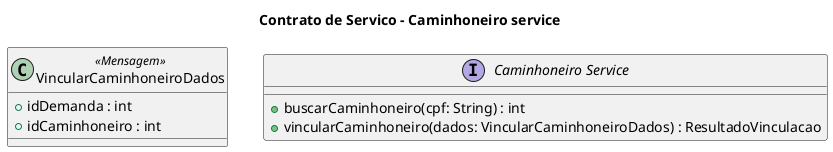
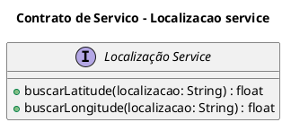
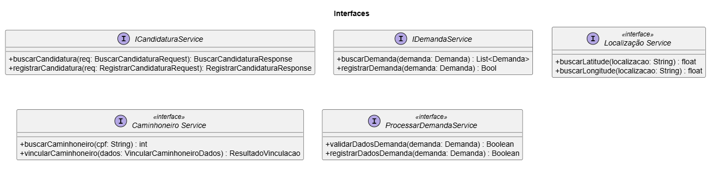

# Autores

- Henrique Finatti 22123030-3
- Mateus Marana 22123
- Giovanni Morassi 22123025-3
- Tiago Fagundes 22123017-0

# Objetivo do Documento

O objetivo deste documento é descrever o design dos serviços, incluindo suas interfaces, esquemas de mensagens, políticas e acordos de nível de serviço (SLA), de forma a orientar sua implementação e garantir a correta comunicação entre eles.

# Especificacao dos Esquemas de Mensagens



```plantUML
@startuml
title Contrato de Servico - Demanda Service

skinparam classAttributeIconSize 0

interface IDemandaService {
    + buscarDemanda(demanda: Demanda) : List<Demanda>
    + registrarDemanda(demanda: Demanda) : Bool
}

class Demanda <<message>>{
    + Titulo : String
    + Valor : Money
    + Descrição : String
    + Carga : String
    + Prazo : Datetime
    + IdCriadorDemanda : Int
    + LatitudeOrigem : Float
    + LongitudeOrigem : Float
    + EndereçoOrigem : String
    + LatitudeDestino : Float
    + LongitudeDestino : Float
    + EnderecoDestino : String
}

@enduml
```

```plantUML
@startuml
title Contrato de Servico - Processar Demanda Service
interface ProcessarDemandaService <<interface>>{
  + validarDadosDemanda(demanda: Demanda) : Boolean
  + registrarDadosDemanda(demanda: Demanda) : Boolean
}
class Demanda <<mensagem>>{
  - Titulo : String
  - Valor : Money
  - Descricao : String
  - Carga : String
  - Prazo : Datetime
  - IdCriadorDemanda : Int
  - LatitudeOrigem : String
  - LongitudeOrigem : String
  - EnderecoOrigem : String
  - LatitudeDestino : String
  - LongitudeDestino : String
  - EnderecoDestino : String
}
skinparam classAttributeIconSize 0

@enduml
```





### Especificar Interfaces dos Serviços



## Regras de Acesso, Uso e SLA por Servico

### 1. Servico de Candidatura

**Esquemas de Mensagens** (Ver Diagrama PlantUML acima)

**Políticas de Utilizacao:**

- **Autenticacao**: Obrigatoria via token JWT valido. Token deve conter `usuarioId` e perfil.
- **Autorizacao**:
  - `buscarCandidatura`: permitido para dono da demanda, candidatos vinculados e perfis administrativos.
  - `registrarCandidatura`: permitido apenas para usuarios com perfil `ENTREGADOR` ativo.
- **Controle de acesso**: Rate limit de 60 requisicoes/minuto por usuario. Bloqueio temporario em caso de abuso (429).
- **Restricoes de uso**:
  - Nao permite candidatura duplicada (`usuarioId` + `demandaId`).
  - Nao permite candidatura em demanda encerrada, cancelada ou em progresso.
- **Auditoria e rastreabilidade**: Registrar dataHora, usuarioId, ipOrigem, operacao e resultado.

**SLA:**

- **Disponibilidade**: 99.5% mensais
- **Tempo de Resposta**: Buscar P95 <= 800 ms | Registrar P95 <= 1000 ms | Maximo P99 <= 2000 ms
- **Capacidade**: Sustentada de 120 req/s | Pico (5min) de 200 req/s
- **Taxa de Erro Maxima**: <= 1% mensais
- **Comportamento em Falhas**: Timeout de dependencia externa (503), retry tecnico de banco (ate 2), idempotencia em registrarCandidatura (usuarioId, demandaId), erros detalhados (400) e violacoes claras (401, 403, 429).

### 2. Caminhoneiro Service

**Esquemas de Mensagens e Interfaces**
| Operacao / Entidade | Detalhes |
| --- | --- |
| `VincularCaminhoneiroDados` | `idDemanda: int`, `idCaminhoneiro: int` |
| `buscarCaminhoneiro` | Entrada: `cpf: String` | Saida: `int` |
| `vincularCaminhoneiro` | Entrada: `VincularCaminhoneiroDados` | Saida: `ResultadoVinculacao` |

**Políticas de Utilizacao:**

- **Autenticacao**: Obrigatoria via token JWT valido.
- **Autorizacao**: Permitido para que o caminhoneiro se vincule a demanda.
- **Criptografia**: HTTPS obrigatorio e criptografia para dados sensiveis.
- **Restricoes de uso**:
  - Nao permite vincular em mais de uma demanda por vez.
  - Caminhoneiro nao pode ter demanda ativa.
  - Caminhoneiro deve estar logado.
  - Demanda deve existir.

**SLA:**

- **Disponibilidade**: 99%
- **Tempo de Resposta**: ate 3s
- **Taxa de Sucesso**: 99%
- **Capacidade**: 500 req/min
- **Suporte**: Horario comercial (8h-18h)

### 3. Demanda Service

**Esquemas de Mensagens e Interfaces**
| Operacao / Entidade | Detalhes |
| --- | --- |
| `Demanda` | `titulo` (String), `valor` (Money), `descricao` (String), `carga` (String), `prazo` (Datetime), `idCriadorDemanda` (Int), Latitude/Longitude/Endereço de Origem e Destino (Float/String) |
| `buscarDemanda` | Entrada: `Demanda` | Saida: `[Demanda]` |
| `registrarDemanda` | Entrada: `Demanda` | Saida: `Bool` |

**Políticas de Utilizacao:**

- **Autenticacao**: Obrigatoria via token JWT valido.
- **Autorizacao**: `registrarDemanda()` somente o criador da demanda pode registrar.
- **Controle de acesso**: HTTPS obrigatorio.
- **Restricoes de uso**: 500 requisicoes por minuto por usuario.

**SLA:**

- **Disponibilidade**: 99%
- **Tempo de Resposta**: ate 2s
- **Taxa de Sucesso**: 99,5%
- **Capacidade**: 100 req/min/cliente

### 4. Processar Demanda Service

**Esquemas de Mensagens e Interfaces**
| Operacao | Entrada | Saida |
| --- | --- | --- |
| `validarDadosDemanda` | `Demanda` | `Boolean` |
| `registrarDadosDemanda` | `Demanda` | `Boolean` |

**Políticas de Utilizacao:**

- **Autenticacao**: OAuth 2.0 com token JWT.
- **Autorizacao (RBAC)**: Criador da Demanda pode registrar demanda.
- **Criptografia**: HTTPS obrigatorio.
- **Limites de uso**: 300 requisicoes por minuto por cliente.

### 5. Localizacao Service

**Esquemas de Mensagens e Interfaces**
| Operacao | Entrada | Saida |
| --- | --- | --- |
| `buscarLatitude` | `localizacao: String` | `float` |
| `buscarLongitude` | `localizacao: String` | `float` |

**Políticas de Utilizacao:**

- **Autenticacao**: Obrigatoria via token JWT valido + API Key do provedor.
- **Autorizacao**: Cliente podera utilizar na criacao de demanda.
- **Restricoes de uso**:
  - Sera usada somente na criacao de demandas.
  - Cliente deve estar logado.
  - Controle rigoroso para evitar bloqueio externo.

**SLA:**

- **Disponibilidade**: 95%
- **Tempo de Resposta**: ate 5s
- **Taxa de Sucesso**: 90%
- **Capacidade**: 200 req/min
- **Suporte**: Depende do provedor
