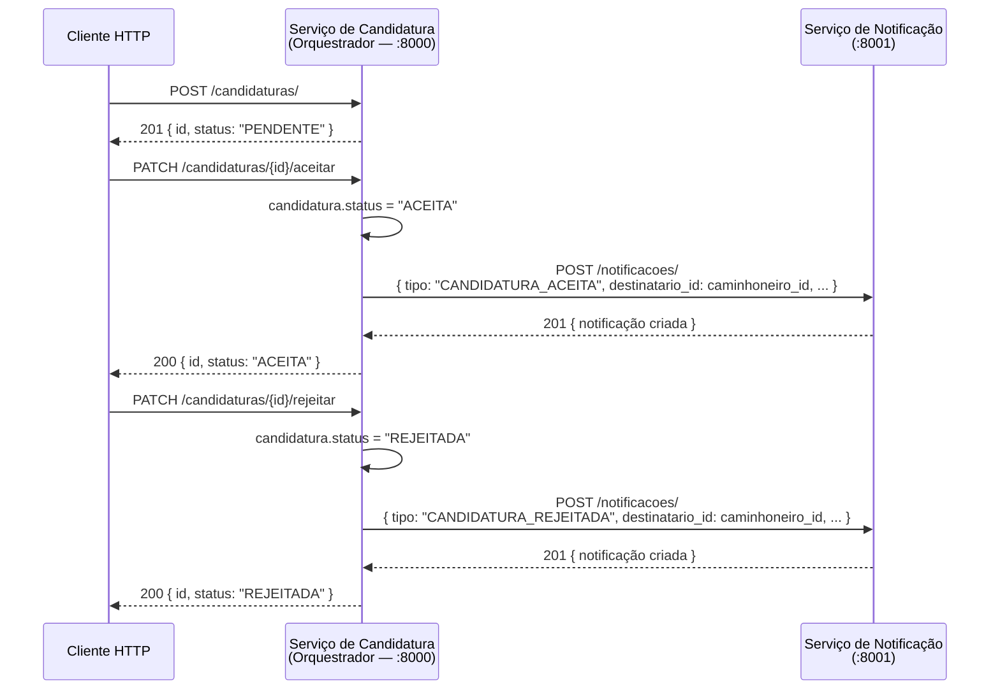

# Lab 8 — Arquitetura Orientada a Serviços

**Projeto:** Mudapp — Marketplace de fretes e mudanças  
**Equipe:** Henrique Finatti · Mateus Marana · Giovanni Morassi · Tiago Fagundes

---

## Objetivo

Implementar dois serviços relacionados ao domínio do Mudapp, definindo o estilo de coordenação adotado (orquestração), elaborando estratégias de testes unitários e de integração, e documentando toda a arquitetura.

---

## Serviços Implementados

| Serviço | Porta | Responsabilidade |
|---------|-------|-----------------|
| `servico_candidatura` | `8000` | Gerencia candidaturas de caminhoneiros a demandas de frete. Atua como **orquestrador**. |
| `servico_notificacao` | `8001` | Recebe e armazena notificações destinadas aos usuários. |

---

## Estilo de Coordenação: Orquestração

### Definição

Na **orquestração**, existe um componente central (orquestrador) que conhece e controla ativamente os demais serviços, determinando o fluxo de execução e chamando cada serviço na ordem correta.

### Escolha e Justificativa

O **Serviço de Candidatura** atua como orquestrador. Ao aceitar ou rejeitar uma candidatura, ele chama ativamente o Serviço de Notificação via HTTP, aguarda a confirmação e só então retorna a resposta ao cliente.

**Por que orquestração e não coreografia?**

| Critério | Orquestração (adotada) | Coreografia |
|----------|----------------------|-------------|
| Rastreabilidade do fluxo | Alta — um único ponto de controle | Baixa — fluxo emergente distribuído |
| Adequação ao cenário | Ideal: fluxo sequencial e dependente | Melhor para fluxos assíncronos e desacoplados |
| Facilidade de testes | Alta — fácil mockar/injetar dependência | Menor — requer infraestrutura de eventos |
| Complexidade de implementação | Baixa com 2 serviços | Exige broker de mensagens (Kafka, RabbitMQ) |
| Auditoria e debug | Simplificado | Mais difícil rastrear a cadeia de eventos |

Com dois serviços e um fluxo de negócio previsível (aceitar/rejeitar → notificar), a orquestração é a escolha mais adequada. A URL do Serviço de Notificação é configurada via variável de ambiente `NOTIFICACAO_URL`, garantindo portabilidade entre ambientes.

---

## Diagrama do Fluxo de Interação

### Fluxo de Aceitação de Candidatura



### Mensagens Trocadas

**SC → SN** (candidatura aceita):
```json
{
  "destinatario_id": 5,
  "tipo": "CANDIDATURA_ACEITA",
  "titulo": "Candidatura aceita!",
  "mensagem": "Parabéns! Sua candidatura para a demanda #10 foi aceita.",
  "dados_extras": {
    "candidatura_id": 1,
    "demanda_id": 10,
    "criador_demanda_id": 3
  }
}
```

**SC → SN** (candidatura rejeitada):
```json
{
  "destinatario_id": 5,
  "tipo": "CANDIDATURA_REJEITADA",
  "titulo": "Candidatura não selecionada",
  "mensagem": "Sua candidatura para a demanda #10 não foi selecionada.",
  "dados_extras": {
    "candidatura_id": 1,
    "demanda_id": 10
  }
}
```

---

## Endpoints

### Serviço de Candidatura — `localhost:8000`

| Método | Rota | Descrição | Status Codes |
|--------|------|-----------|-------------|
| `GET` | `/health` | Health check | 200 |
| `POST` | `/candidaturas/` | Criar candidatura | 201 |
| `GET` | `/candidaturas/` | Listar todas | 200 |
| `GET` | `/candidaturas/{id}` | Buscar por ID | 200, 404 |
| `PATCH` | `/candidaturas/{id}/aceitar` | Aceitar → orquestra notificação | 200, 404, 409 |
| `PATCH` | `/candidaturas/{id}/rejeitar` | Rejeitar → orquestra notificação | 200, 404, 409 |

### Serviço de Notificação — `localhost:8001`

| Método | Rota | Descrição | Status Codes |
|--------|------|-----------|-------------|
| `GET` | `/health` | Health check | 200 |
| `POST` | `/notificacoes/` | Criar notificação | 201 |
| `GET` | `/notificacoes/` | Listar todas | 200 |
| `GET` | `/notificacoes/{id}` | Buscar por ID | 200, 404 |
| `GET` | `/notificacoes/destinatario/{id}` | Listar por destinatário | 200 |

A documentação interativa (Swagger UI) fica disponível em `/docs` de cada serviço.

---

## Estrutura do Projeto

```
Lab 8/
├── docker-compose.yml
├── pytest.ini
├── README.md
├── servico_candidatura/
│   ├── __init__.py
│   ├── main.py            # App FastAPI
│   ├── models.py          # Modelos Pydantic (CandidaturaCreate, CandidaturaResponse)
│   ├── services.py        # Lógica de negócio (CandidaturaService)
│   ├── routes.py          # Rotas da API + injeção de dependência
│   ├── orquestrador.py    # Lógica de orquestração (chamada ao Serviço de Notificação)
│   ├── Dockerfile
│   └── requirements.txt
├── servico_notificacao/
│   ├── __init__.py
│   ├── main.py            # App FastAPI
│   ├── models.py          # Modelos Pydantic (NotificacaoCreate, Notificacao)
│   ├── services.py        # Lógica de negócio (NotificacaoService)
│   ├── routes.py          # Rotas da API + injeção de dependência
│   ├── Dockerfile
│   └── requirements.txt
└── tests/
    ├── conftest.py                  # Configuração de sys.path para imports
    ├── requirements.txt
    ├── test_candidatura_unit.py     # Testes unitários do Serviço de Candidatura
    ├── test_notificacao_unit.py     # Testes unitários do Serviço de Notificação
    └── test_integration.py          # Testes de integração (ambos os serviços)
```

---

## Execução

### Pré-requisitos

- [Docker](https://www.docker.com/) e Docker Compose, **ou**
- Python 3.12+

### Com Docker Compose (recomendado)

```bash
# A partir da pasta Lab 8/
docker compose up --build
```

Os serviços ficam disponíveis em:
- Candidatura: http://localhost:8000/docs
- Notificação: http://localhost:8001/docs

Para parar:
```bash
docker compose down
```

### Sem Docker (desenvolvimento local)

```bash
# A partir da pasta Lab 8/

# Instalar dependências
pip install -r servico_notificacao/requirements.txt
pip install -r servico_candidatura/requirements.txt

# Terminal 1 — Serviço de Notificação
uvicorn servico_notificacao.main:app --port 8001 --reload

# Terminal 2 — Serviço de Candidatura
NOTIFICACAO_URL=http://localhost:8001 uvicorn servico_candidatura.main:app --port 8000 --reload
```

> **Windows (PowerShell):**
> ```powershell
> $env:NOTIFICACAO_URL="http://localhost:8001"; uvicorn servico_candidatura.main:app --port 8000 --reload
> ```

---

## Testes

### Estratégias

#### Testes Unitários

Validam a **lógica interna** de cada serviço de forma completamente isolada, sem dependências externas.

- Não fazem chamadas HTTP
- Cada classe de serviço (`CandidaturaService`, `NotificacaoService`) é instanciada de forma isolada por fixture
- Cobrem: criação de entidades, validações de estado, mudanças de status, erros esperados e montagem de payload

**Arquivo:** `tests/test_candidatura_unit.py` — 16 testes  
**Arquivo:** `tests/test_notificacao_unit.py` — 9 testes

#### Testes de Integração

Validam a **comunicação entre os serviços**, testando o fluxo completo de orquestração.

- Ambos os serviços são iniciados in-process via `TestClient` do FastAPI
- A chamada HTTP do Serviço de Candidatura ao Serviço de Notificação é interceptada via `httpx.ASGITransport`, que aponta para o app real de notificação — sem abrir socket de rede
- Validam que: a notificação é criada corretamente, o status da candidatura é atualizado, e erros de estado (404, 409) são retornados corretamente

**Arquivo:** `tests/test_integration.py` — 12 testes

### Executando os Testes

```bash
# A partir da pasta Lab 8/

# Instalar dependências de teste
pip install -r tests/requirements.txt

# Rodar todos os testes
pytest

# Com saída detalhada
pytest -v

# Apenas unitários
pytest tests/test_candidatura_unit.py tests/test_notificacao_unit.py -v

# Apenas integração
pytest tests/test_integration.py -v
```

---

## Tecnologias

| Tecnologia | Uso |
|-----------|-----|
| [FastAPI](https://fastapi.tiangolo.com/) | Framework web dos serviços (async, tipagem, Swagger automático) |
| [Pydantic v2](https://docs.pydantic.dev/) | Validação e serialização de modelos |
| [httpx](https://www.python-httpx.org/) | Cliente HTTP assíncrono para chamadas de orquestração |
| [Uvicorn](https://www.uvicorn.org/) | Servidor ASGI |
| [pytest](https://pytest.org/) | Framework de testes |
| [Docker Compose](https://docs.docker.com/compose/) | Orquestração de containers |
